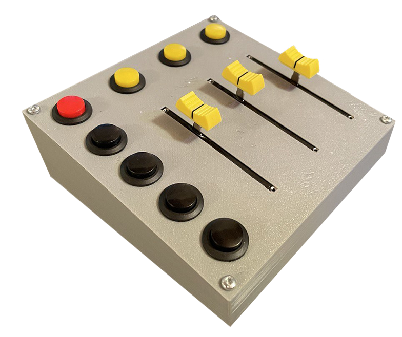
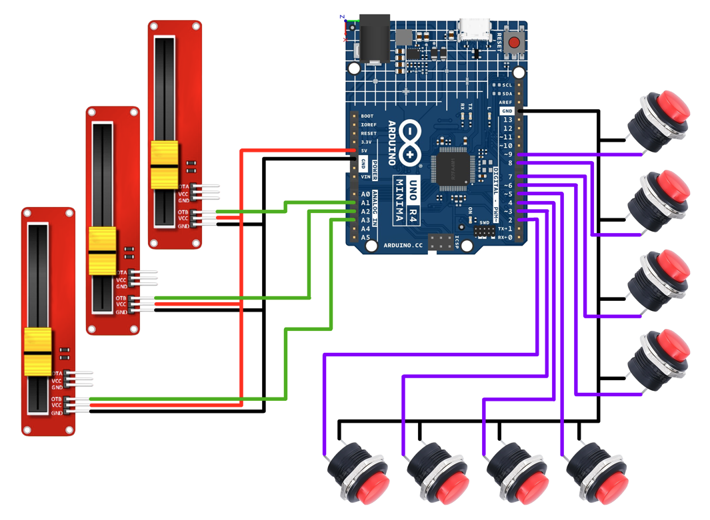

# arduino-button-slider-panel
Goal: create a control panel composed by buttons and sliders in order to use it as macro pad and audio mixer for a Windows PC. The control panel is created
with an Arduino board and [deej open-source project](https://github.com/omriharel/deej)\

## What you need
+ Arduino UNO Minima
+ 8 Momentary Push Buttons
+ 3 Slide Potentiometers
+ Solder Kit and cables (or Dupot cables)
+ (Optional) [3D printer](#3D-printed-case)
## Schematics

## 3D printed case
If you wish print a case for all the hardware I design 2 parts: [top](./3Dmodel/top.stl) and [bottom](./3Dmodel/bottom.stl).
Them can be merged with 4 screws with 3mm diameter.
